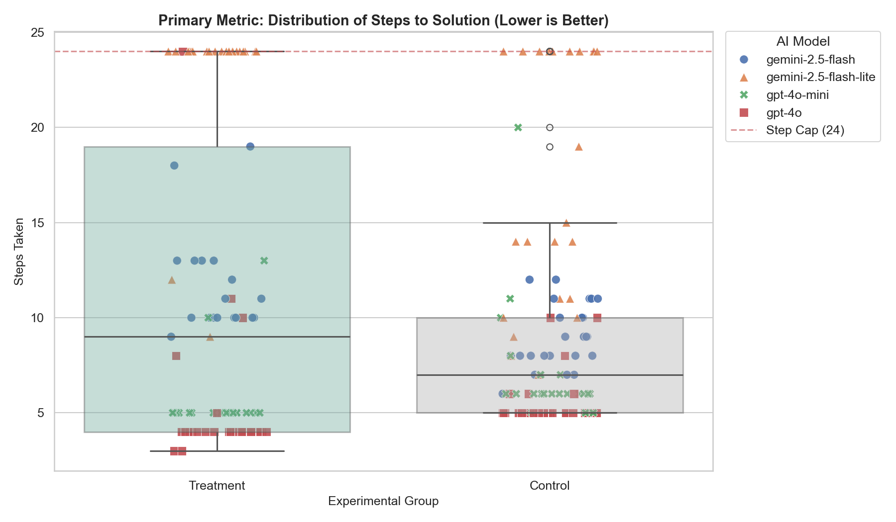
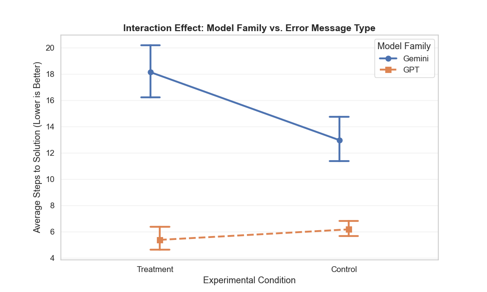
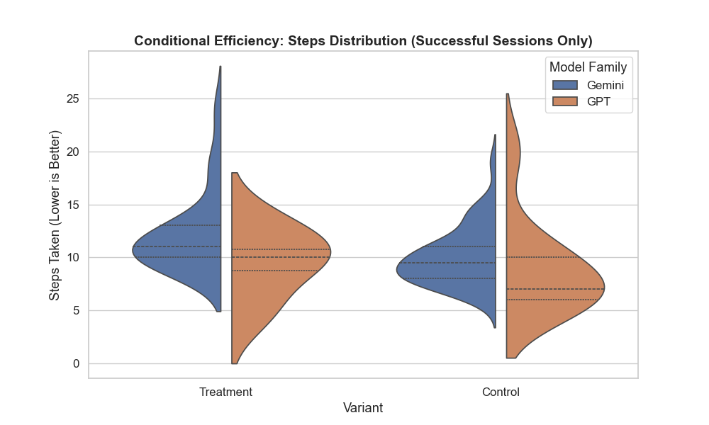
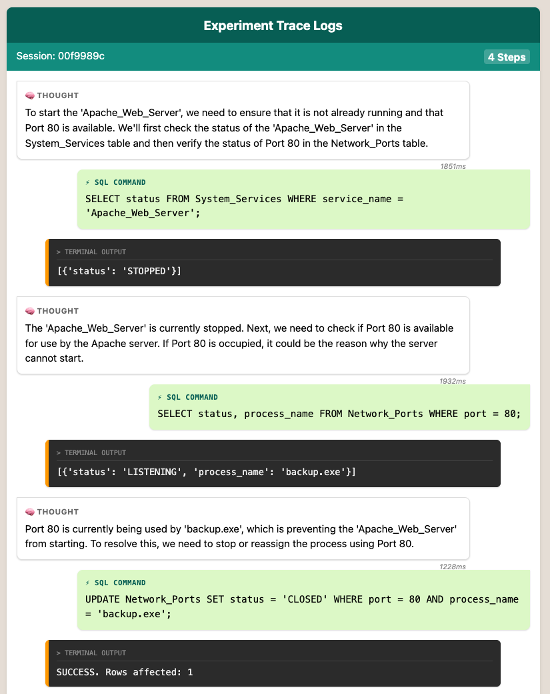
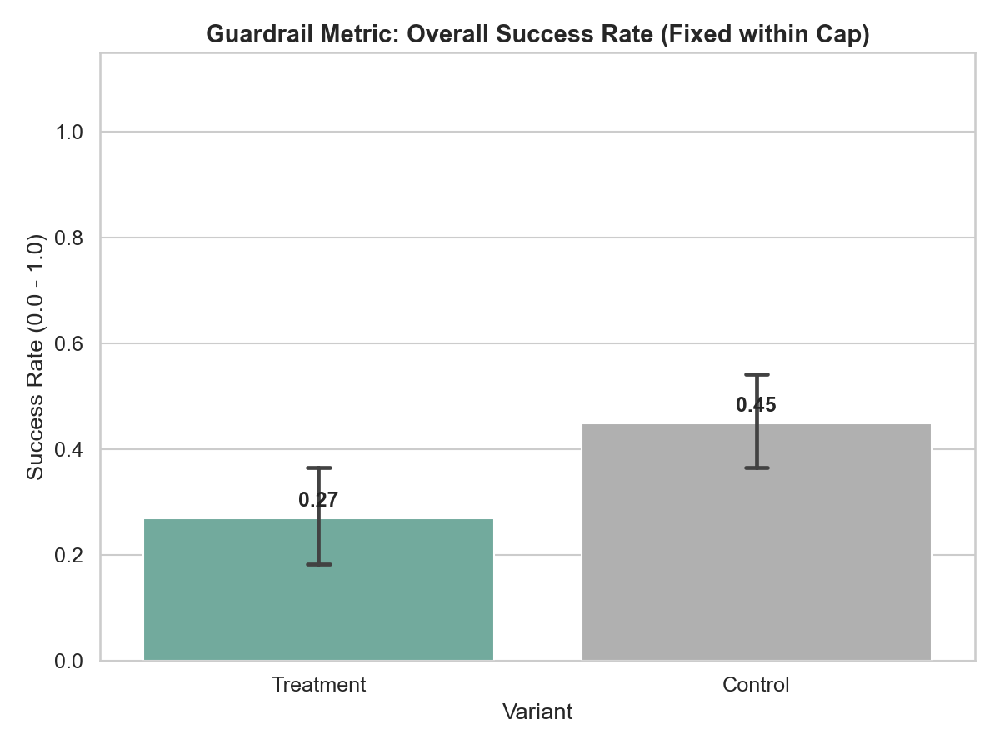
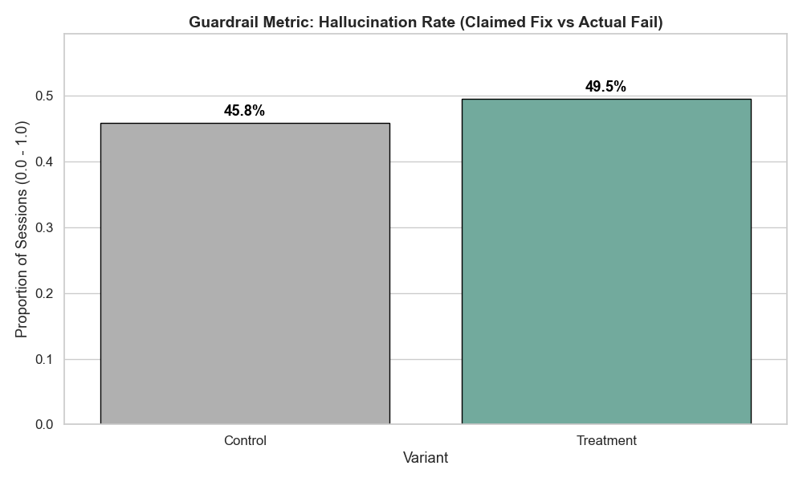

# Agentic-ExP: A Framework for Synthetic Experimentation
> **Building "Institutional Memory" for AI Systems through Rigorous Automated Simulation.**

  

## 1. Project Goals
The ultimate vision is an attempt to create a self-improving software development simulation where **Architect Agents** design experiments, **User Agents** test features, and **Meta-Analysis Agents** distill the results into institutional knowledge.

Currently this repository hosts the **Proof of Concept (POC)**: A rigorous controlled experiment (A/B Test) measuring how "Cognitive Friction" (error message quality) impacts the problem-solving efficiency of different LLM architectures. 

All further development of multi-layered agentic workflows will be saved in this repo as well.

### My Motivation
My primary motivation is self-education: to build a custom LLM-based simulated arena for testing advanced experimentation techniques hands-on. 

I am using this platform to move beyond simple evaluation and master complex methodologies including:
* **Causal Inference & Heterogeneous Treatment Effects (HTE)**
* **Guardrail Monitoring**
* **Meta-Analysis** (driven by Agentic Workflows)
* **Orthogonal Array Testing (OAT)**
* **Bayesian Optimization**
* **Safety and Security**
* **And more...**

---

## 2. Key Result of the quick POC: The "Cognitive Friction" A/B Test

**The Scenario:** 200 randomized LLM-based agents were tasked with fixing a "Port Conflict" on a simulated server.
* **Control Group:** Received cryptic, legacy error codes (e.g., `0x80004005`).
* **Treatment Group:** Received helpful, semantic error messages (e.g., "Port 80 is in use").

### 📉 Primary Metric: Steps to Solution
*Does "Helpful" text actually make agents faster?*

*(Figure 1: Distribution of steps taken. Note the massive variance in the Control group vs. the tight clustering in the Treatment group.)*

### 📊 Statistical Conclusion
We observed a **Simpson's Paradox** where the aggregate data hid a critical insight.

* **Global P-Value:** `0.46` (No significant difference globally).
* **Subgroup P-Value:** `< 0.001` (Highly Significant Interaction Effect).

**The Discovery:**
The "Friendly" error messages helped robust models (**GPT-4o**) but actively **confused** weaker models (**Gemini Flash-Lite**), causing them to regress.

*(Figure 2: The "Crossing Lines" of the Interaction Effect. This proves that prompt engineering cannot be "one size fits all"—what helps a Frontier Model can hurt a Distilled Model.)*

### 🎻 Deep Dive: Conditional Efficiency (Survivors Only)
We performed a conditional analysis filtering only for **Successful Sessions** to measure the true "Cost of Friction" for capable agents, removing the noise of timeouts.

*(Figure 3: Violin plot of steps taken for successful sessions. Split by Model Family.)*

**The Divergence Continues:**
Even among agents that successfully solved the problem, the split remains stark:
* **GPT Models (Orange):** The distribution shifts **downwards** in the Treatment group, confirming that semantic error messages helped them solve the task faster.
* **Gemini Models (Blue):** The distribution shifts **upwards** and widens in the Treatment group. This proves that the "Friendly" text introduced cognitive drag, forcing even successful Gemini agents to take more steps to reach the solution.

---

## 3. The "SQL-as-OS" Simulator
For this POC simplicity, instead of using real OS (virtual OS or 'honeypot' like systems are definitely an option though), I built a simple deterministic **Virtual Kernel** running entirely in memory. So, LLM-agents actually interacting with a 'real' system with its rigid logic. This idea can be extended to more complex environments later.

* **State:** The OS state is mapped to SQLite tables (`System_Services`, `Network_Ports`).
* **Action:** Agents use SQL to "Look" (`SELECT`) and "Act" (`UPDATE/DELETE`).
* **Feedback:** A Python Kernel wrapper intercepts queries and enforces logic (e.g., preventing a service start if a dependency is down).

This allows for **Instant Resets**, ensuring perfect independence between experimental units.

### 🕵️‍♂️ Visualizing the Agent's Thought Process
To debug and analyze agent behavior, I built a custom visualization tool that renders the logs into a "Chat Interface." This allows us to inspect the **Chain-of-Thought** reasoning alongside the SQL execution.

*(Figure 2: A replay of an agent diagnosing the system. Note the Internal Monologue (White) guiding the SQL Action (Green) and the resulting System Output (Dark).)*

[📄 View a full interactive HTML Trace log here](trace_viewer.html)  
*(Note: GitHub does not render HTML directly. Please download this file to view it in your browser.)*

---

## 4. Trustworthy Experimentation & Guardrails
Following best practices for online experimentation, this framework monitors negative side effects.

### ✅ Sample Ratio Mismatch (SRM) Check
We verified randomization validity.
* **P-Value:** `0.32` (No evidence of bias in assignment).

### 🛡️ Guardrail: Success Rate
Did the treatment simply cause agents to give up faster?

*(Figure 3: Global success rates. The regression in the Gemini subgroup dragged down the overall win rate for the Treatment group.)*

### 🚨 Guardrail: Hallucinations (The "Liar" Metric)
We tracked instances where an agent claimed `is_fixed=True`, but the ground truth database remained broken.

*(Figure 4: Hallucination Rate by Variant. Interestingly, GPT models showed a ~50% hallucination rate (Overconfidence), while Gemini models failed honestly (Timeout).)*

### Potential Improvements
There are lots of opportunities to enhance the guardrail system:
* **A/A Testing:** Regularly run A/A tests to validate the entire experimentation pipeline.
* **Cost Monitoring:** Track token usage and system latency to ensure efficiency.
* **Adversarial Testing:** Introduce random "glitches" in the OS state to test agent robustness. They can be possibly injected by a "Chaos Monkey" (LLM-based) agent.
* **Automated Anomaly Detection:** Use statistical process control (SPC) charts to flag unexpected shifts in performance metrics.
* Many more...

---

## 5. Conclusion for this POC

This experiment successfully demonstrated that **Environmental Feedback** is a critical variable in Agent performance. It also highlighted a dangerous **Robustness Gap** between model tiers.

More detailed analysis and visualizations can be found in the [Experiment Analysis Notebook](exp_data_analysis.ipynb).

## 6. Next Steps & Roadmap

**Roadmap:**
1. Develop multiple layered agentic workflows to automate the entire experimentation lifecycle:
    * **Architect Agents** to design experiments.
    * **User Agents** to run experiments.
    * **Meta-Analysis Agents** to analyze results and generate insights.
2. Expand the OS simulator to include more complex scenarios (e.g., File System Errors, Network Failures) or replace with a real OS environment (or honeypot-like scenarios).
3. Integrate advanced experimentation techniques like Orthogonal Array Testing (OAT) and Bayesian Optimization.
4. Implement a RAG-based "Meta-Memory" system to allow agents to learn from past experiments.
5. Explore safety and security aspects, including adversarial testing and anomaly detection.
6. Many more...